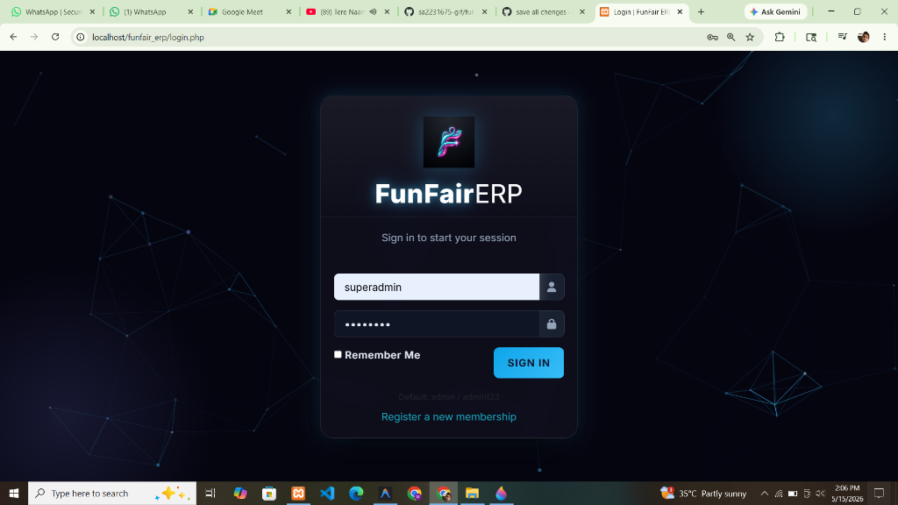
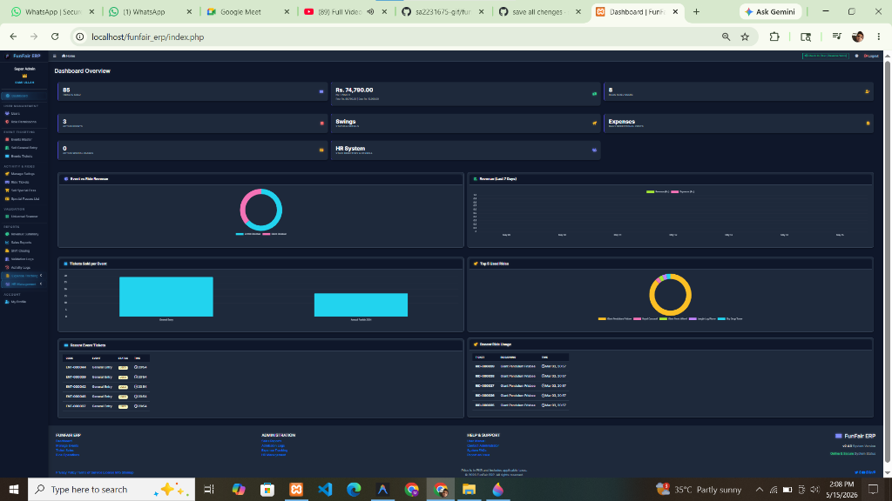

# FunFair ERP

FunFair ERP is a comprehensive, multi-tenant capable Enterprise Resource Planning (ERP) system designed specifically for managing funfairs, amusement parks, and large-scale ticketing events. It streamlines ticketing, admission control, ride management, role-based access control, and sales reporting all within a centralized, interactive dashboard.

## Screenshots

### Login Screen


### Dashboard Overview


## How to Use

1. **Environment Setup:** Ensure you have a local server environment running (e.g., XAMPP, WAMP, or LAMP).
2. **Clone the Repository:** Place the `funfair_erp` project folder inside your server's root directory (e.g., `htdocs` for XAMPP or `www` for WAMP).
3. **Database Configuration:**
   - Create a new MySQL database named `funfair_erp`.
   - Import the provided `funfair_erp (1).sql` (contains seeded sample data) or `database.sql` into the newly created database.
4. **Connect Database:** Update the database credentials in `config/config.php` if your local database uses a different username or password (default is usually `root` with no password).
5. **Launch Application:** Open your web browser and navigate to `http://localhost/funfair_erp`.
6. **Login:** Use the default credentials provided below to access the system.

## Default ID/Password for Users

- **Super Admin:**
  - Username: `admin`
  - Password: `admin123`
- **Other Users / Operators (Demo fallback):**
  - Password: `operator123`

## Features

- **Role-Based Access Control (RBAC):** Granular permission settings for Super Admins, Admins, Event Managers, Salespersons, Gate Operators, and Ride Operators.
- **Event & Ride Management:** Create and manage events and individual park rides (swings) with customizable pricing, capacities, and durations.
- **Ticketing System:** Book, print (single or bulk), and cancel tickets seamlessly for events and rides.
- **Admission Validation:** Real-time entry validation by gate operators, ensuring accurate admission logs.
- **Interactive Dashboard:** Beautiful, neon-styled AdminLTE dashboard to visualize sales data, active users, and recent system activities.
- **User Management:** Complete user lifecycle management including profile updates and role assignments.
- **Activity Logging:** Comprehensive tracking of all user actions for audit trails and enhanced security.

## Tech Stack

- **Frontend:** HTML5, CSS3, JavaScript, Bootstrap 4, AdminLTE 3
- **Backend:** PHP (PDO for secure database interactions)
- **Database:** MySQL
- **Libraries/Plugins:** jQuery, FontAwesome, Particles.js (interactive login background)

## Future Integration

- **Payment Gateway Integration:** Adding Stripe or PayPal for seamless online ticket booking.
- **QR Code / Barcode Scanning:** Faster ticket validation at gates and rides using mobile devices or dedicated scanners.
- **Mobile Application API:** RESTful endpoints for on-the-go management and validation via mobile apps.
- **Advanced Analytics:** AI-driven sales forecasting and detailed visitor demographic reporting.
- **Customer / Student Portal:** Self-service portal for users to book and manage their own tickets.
- **Enhanced Multi-Tenancy:** Robust capabilities to manage multiple distinct parks or fairs completely isolated under one central system instance.

## File/Folder Project Structure

```text
funfair_erp/
├── assets/                 # CSS, JS, and image assets
├── config/                 # Configuration files (e.g., config.php for DB connection)
├── includes/               # Reusable UI components (header, footer, sidebar layouts)
├── modules/                # Core application modules
│   ├── admission/          # Entry validation logic
│   ├── dashboard/          # Dashboard widgets and statistics
│   ├── events/             # Event CRUD operations
│   ├── reports/            # Sales and activity reporting
│   ├── rides/              # Ride/swing management and validation
│   ├── roles/              # Role and permission management
│   ├── tickets/            # Ticket booking, printing, and cancellation
│   └── users/              # User management and authentication flows
├── uploads/                # User uploads (profile pictures, event images)
├── database.sql            # Base database schema structure
├── funfair_erp (1).sql     # Database schema with seeded demo data
├── index.php               # Main dashboard entry point (requires authentication)
├── login.php               # Authentication page with dynamic user selection
├── logout.php              # Session termination script
└── register.php            # User registration page
```
